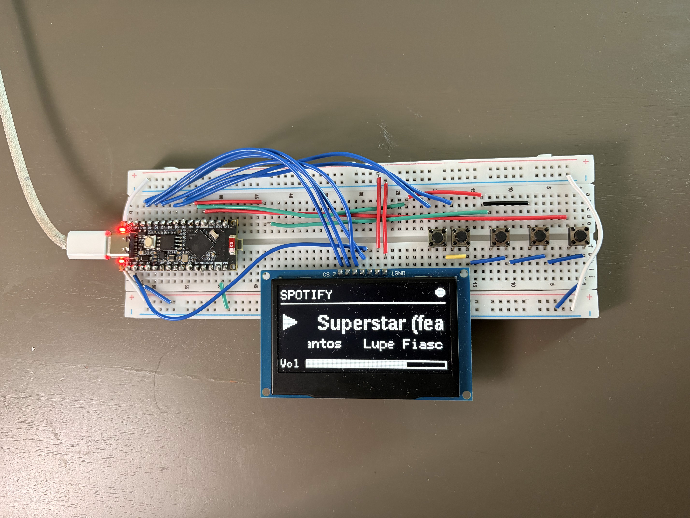
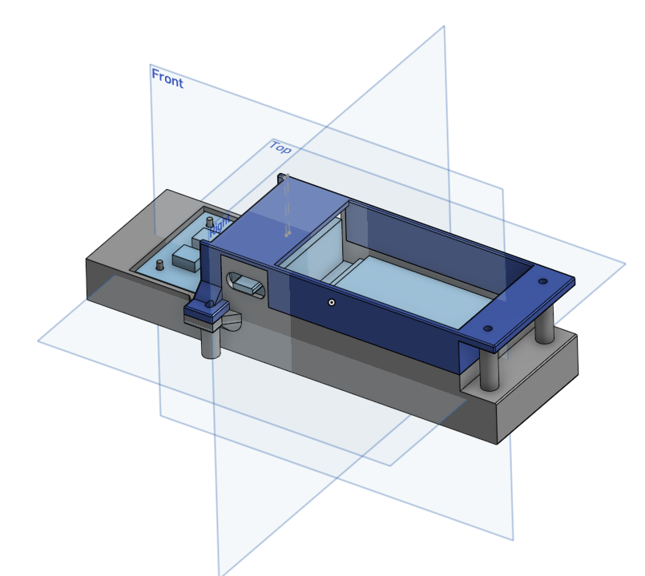
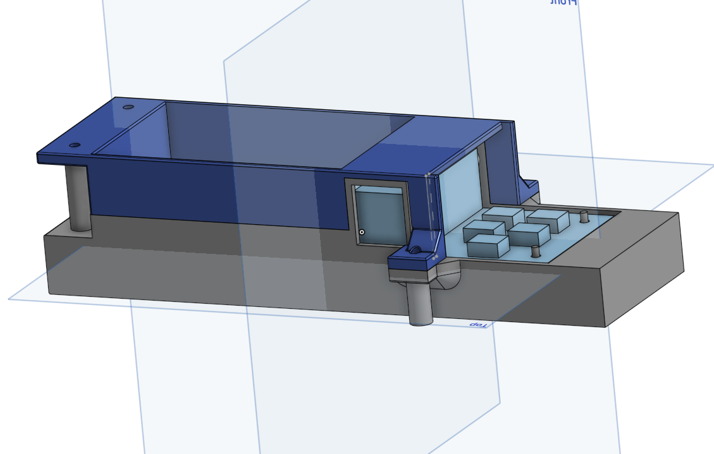
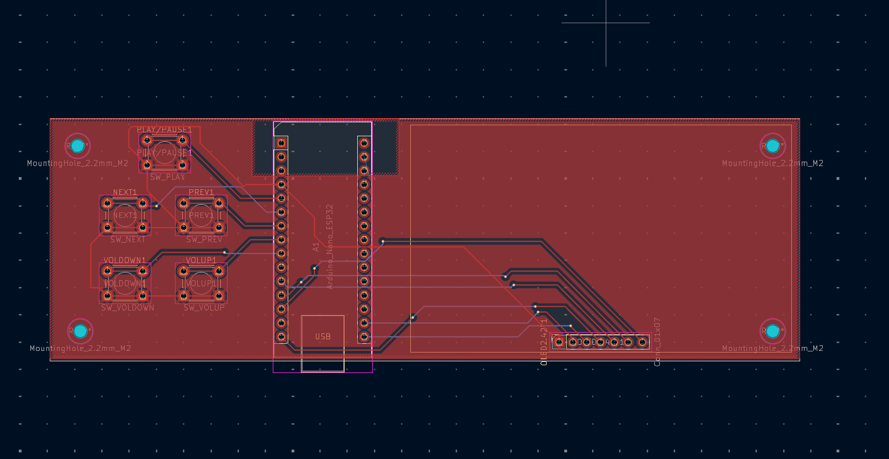
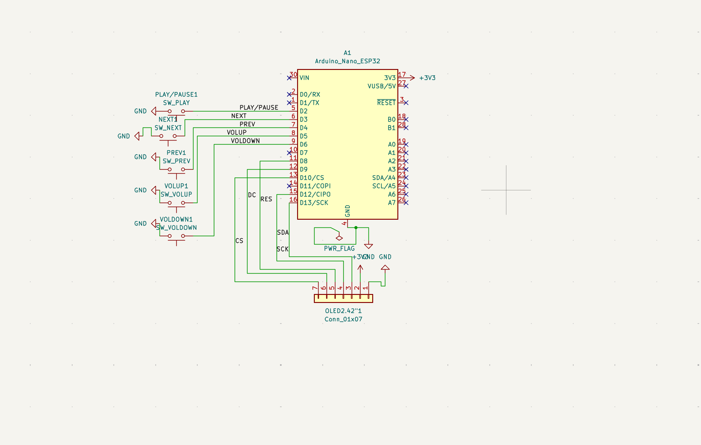

# MusicPi

 

A server + remote that plays music so I don't have to be on my phone or on my computer to listen to music.

It controls playback with no phone, or computer necessary, so you can relax and listen to music **without the temptation of screens**. The case and PCB are all custom designed, by [@WillZlog](https://www.github.com/WillZlog).

## Tech Stack

**Remote:** ESP32 S3, buttons, OLED

**Receiver Dongle:** ESP32-C3 Super Mini, USB A - USB C Cable

**Raspberry Pi:** Python, Serial Listener, Librespot/Spotify

**CAD:** Onshape, custom enclosure

## Features

**Radio Mode:** Streams songs directly from commercial-free internet radio stations like FIP (France Inter Paris) or TSF (Télégraphie Sans Fil), to give you the classic radio style

**Physical Remote:** A physical remote with a (soon toggleable) OLED screen, and buttons, for full control of your music

**Raspberry Pi Music Server:** A Raspberry Pi streaming the music directly to speakers, no phone necessary!

**Spotify Integration:** Connects seamlessly directly with Spotify, and shows up as a speaker in the devices section

**OLED Screen:** Toggleable OLED screen that allows for quick checking of what song is playing, or which radio station is on!

**Uninterrupted listening:** ESP-NOW and unicast create a delayless connection between dongle and remote!

**Headless Setup:** Runs headlessly after setup, with no monitor or keyboard required.

**Custom PCB and custom case:** Every part, from the PCB to the case, was designed by yours truly, millimeter by millimeter, ensuring an accurate fit!

## How It Works

1. User presses a button on the remote
2. The remote sends a plain-text ESP-NOW command to the ESP32-C3 receiver dongle
3. Data gets transferred from ESP32-C3 to Raspberry Pi via serial USB connection (could be wireless)
4. Python script, `music_controller.py`, reads the command and then through librespot controls playback accordingly
5. Music gets streamed through Bluetooth to connected speakers

## Roadmap

- Battery for the remote so it doesn't have to be constantly plugged in

- Deep Sleep to save battery life

- Smaller enclosure design

## Controls
- Next x3 opens service menu
- Prev x3 toggles screen
- Play/pause x3 toggles radio mode

## Media

### Remote Prototype

### CAD Designs

  
  

### PCB and Schematic

  
  

## Current Status

* Working
  * Pi server
  * Remote communication with server
  * OLED
  * Toggleable OLED
* Designed
  * Case
  * PCB
* In Progress
  * Better case design
* Planned
  * Battery system
  * Deep Sleep

## Authors

- [@WillZlog](https://www.github.com/WillZlog)

## License

This project is licensed under the MIT License.